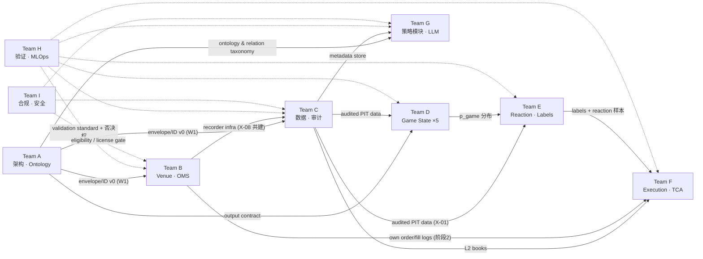

# 体育预测市场交易系统 — Research Program Charter v0.2

日期：2026-07-22 · 状态：**CONDITIONAL_GO**（见 §0.5 Program Decision）

**Changelog**
- v0.2（2026-07-22 晚）：合并外部评审。P0-1 venue 规则版本化（§8.1 venue_rule_snapshot，X-07 数值结论在数据组件上线前标 PRELIMINARY）；P0-2 稳定 ID registry（catalog_registry.csv + junction table，新增 operational_evidence 类目）；P1：deterministic replay 三级合同（§8.2）、X-01 比较语义精确化、X-04 多容差对齐、X-06 两级 gate + bootstrap CI、G/F sub-lead 分层、Team I/D4/D5 入机读 registry；CONDITIONAL_GO 决议与 NO-GO 清单入文。另：当日复核官方文档，体育市场 marketable order delay 官方值为 **1 秒**（此前 ~3s 来自搜索摘要、当时已标 partially_verified——该出入正是 P0-1 的成立理由）。
- v0.1（2026-07-22 晨）：首轮交付。
基础材料：2026-07-21 高层规划报告（preview.html）、research_catalog.csv（54 项）、implementation_catalog.csv（25 项）
本 charter 的定位：**继承**高层报告已确立的三模型架构、成熟度判断、验证阶梯与"NBA moneyline + 60/180s barrier + taker"默认候选，**不重复**这些内容；只交付让九支团队立即并行开工所缺的部分——团队接口、目录分配、审计计划、模板、首批实验和资源路线。

---

## 0. 本轮已完成的外部核实（2026-07-22）

见附录 A。所有涉及 PMXT Archive、Polymarket/Kalshi 文档、PMXT 仓库、seed 论文可达性与体育数据源的说法均在今天做过一轮独立核实，状态分为 verified / partially_verified / not_verified / contradicted。**charter 中任何标注 [待核实] 的条目在附录 A 之外不得被当作事实引用。**

---

## 0.5 Program Decision（2026-07-22 外部评审后）

```yaml
program_decision:
  status: CONDITIONAL_GO
  approved_scope:        # 今天启动
    - architecture_and_schema
    - data_audit
    - live_public_market_recording
    - game_state_baselines
    - label_specification
    - taker_simulator_specification
    - validation_registry
    - compliance_and_license_review
  blocked_scope:         # 现在不启动
    - real_money_execution
    - maker_queue_model_promotion
    - multi_venue_live_arbitrage
    - copy_trading_live
    - llm_hot_path
  blocking_amendments:   # v0.2 状态
    - versioned_per_market_venue_rule_snapshot   # 规范已入 §8.1；B/C 实现数据组件并被 replay 消费后，X-07 方可出正式结论
    - stable_catalog_item_ids                    # 已完成：catalog_registry.csv + catalog_team_assignments.csv
    - deterministic_replay_contract              # 规范已入 §8.2；X-01/X-09 按 Level 1+2 验收
    - precise_X01_comparison_semantics           # 已入 §3 Phase 3 与 X-01
  promotion_gates:
    - X01_L2_reconstruction
    - X02_timestamp_quality
    - X05_label_approval
    - X09_deterministic_vertical_slice
    - Team_I_compliance_green
```

**NO-GO 清单（与 §1 Team A 的 MVP 不做事项叠加，任何团队不得启动）**：真实资金交易；maker 策略上线；基于 PMXT L2 声称精确 queue fill；多 venue 同时下单套利；copy trading 真实跟单；LLM 进 hot path；RL；大规模微服务化；以 README 收益率筛选策略；任何未登记 registry 的"快速回测"。

**X-07 特别限制**：在 venue_rule_snapshot 数据组件上线并被 replay 消费之前，X-07 可以先跑（管线搭建与敏感性分析），但全部数值结果标注 `PRELIMINARY`，不得作为正式结论或任何 go/no-go 输入。

---

## 1. 九支团队 Charter

每支团队的详细职责以任务书（用户 prompt 第四节）为准，此处只补充任务书没有的四样东西：负责人画像、接口（输入/输出 artifact）、前两周任务、验收 gate。所有团队共享：统一 event envelope、ID 体系、quality flags、model output contract（Team A 第 1 周发布 v0，两周一个 minor 版本）。

### Team A — Program Architecture、Ontology 与系统集成
- **负责人画像**：做过 event-sourced 交易系统与数据建模的 staff 级架构师；能逐条读结算规则，也能写 schema；考核指标是接口稳定性和 ADR 质量，不是代码量。
- **输入**：所有团队的接口需求；高层报告的架构 Mermaid（直接继承为 v0）。
- **输出**：`event_envelope.schema` v0（第 1 周）；ID registry（game/competition/participant/venue_event/market/outcome/condition）；market relation taxonomy（identity/subset/superset/overlap/mutex/exhaustive/incompatible）；ADR 序列；RACI；MVP 不做事项清单。
- **前两周**：发布 envelope v0 与 ID v0；把高层报告三张 Mermaid 拆成可维护的 `.mmd` 源文件；写前 5 条 ADR（引擎选型延迟决策、native-vs-unified 边界、hot path 划分、event sourcing、fail-closed）。
- **验收 gate**：B/C/E 三队都能用 envelope v0 写通各自的第一个 artifact，无需私下扩展字段。
- **MVP 不做事项（种子清单，A 扩充）**：maker 执行、多 venue 同时执行、LLM 进 hot path、RL、F1/MLB 生产化、自建 AMM、链上做市、微服务化。

### Team B — Venue Connectivity、OMS/EMS 与交易基础设施
- **负责人画像**：做过 OMS/交易网关（加密或传统均可），熟 Python asyncio 且能评估 Rust core；处理过 unknown order state 和断线对账事故的人优先。
- **输入**：A 的 envelope/ID；I 的 eligibility 结论（哪些 venue 可以合法接）。
- **输出**：venue capability matrix；canonical OMS order-state machine；gateway interface；paper/shadow adapter；vertical slice（X-09）；自有订单数据 schema（喂给 F）；**venue-rule snapshotter（§8.1）——按市场、按时间抓取 delay/fee/tick/取消政策，与 C 共建存储**。OMS 状态机必须显式处理"delay window 内不可撤单"与"开赛清簿（开赛时间变动可能不清）"两种官方行为。
- **前两周**：Polymarket market WS + Kalshi WS 的最小 recorder（与 C 共建，即 X-08）；OMS 状态机纸面设计（含 idempotency、duplicate ack、cancel/replace、restart recovery 的状态转移表）；NautilusTrader vs 轻量 monolith 的评估计划（不是决定——决定要等 vertical slice 数据）。
- **验收 gate**：X-09 确定性 replay 通过；capability matrix 每一格都有官方文档引用和核实日期。
- **失败条件**：任何"SDK 当作完整交易后端"的设计直接打回。

### Team C — Prediction-Market Data、PMXT Archive Audit 与数据质量（最高优先级之一）
- **负责人画像**：数据工程 + 市场数据 QA 背景；Parquet/DuckDB/ClickHouse 熟练；审计过 tick 数据；对时间戳偏执。
- **输入**：A 的 envelope；PMXT Archive；venue 官方接口。
- **输出**：可运行 audit notebook/scripts；data quality report；L2 reconstructor（带 quality flags）；market metadata snapshotter；**venue-rule snapshot 的 point-in-time 存储（§8.1，append-only，供 replay as-of join）**；point-in-time join spec；数据可用性矩阵（五个验证对象 × 能/不能）；"必须从现在自采"字段清单。
- **前两周**：X-01、X-02、X-08 全部启动；§3 审计计划 Phase 0-1 完成。
- **验收 gate**：X-01 通过（确定性重建 + 交叉核对）；每个数据源在 §8 checklist 上有逐项记录。
- **失败条件**：任何"文档说有所以有"的结论；audit 必须 hands-on。

### Team D — Game State Model Research（D1 NBA / D2 NFL / D3 足球 / D4 MLB / D5 F1）
- **负责人画像**：各运动一名体育统计/量化研究员，能读文献也能落地 GBDT/贝叶斯模型；D5 需要真实赛车领域知识（tyre/pit/SC 语义）。
- **输入**：C 的历史数据管道；A 的 game_id/阶段表示；H 的验证协议。
- **输出**：每个 subteam：evidence table、最简 baseline、stronger interpretable model、ML challenger、calibration 方案、point-in-time feature list（严格区分实时可用/事后可得）、数据与生产可行性评分、与 venue 市场覆盖的匹配评估。
- **前两周**：D1 启动 X-06；D2/D3 用 nflfastR/StatsBomb 复现各自经典 baseline（Lock & Nettleton；Dixon-Coles/Robberechts）；D4/D5 只做数据盘点和 evidence table，不建模（资源集中主线）。
- **验收 gate**：任何模型必须同时报告 vs market prior 的增量与校准，只报 accuracy 视为未交付。
- **统一 output contract**：`p_game(state_t) → 状态转移分布`（不是只有最终胜率），格式由 A 定义、E 消费。

### Team E — Market Reaction、Contract Sensitivity 与 Labeling
- **负责人画像**：微观结构研究员，做过 event study 和 label 工程，懂 survival/competing risks；能抵抗"方向对了就是 alpha"的诱惑。
- **输入**：C 的重建 L2；D 的 p_game 输出（初期可用简单 proxy）；A 的合约关系图。
- **输出**：label specification（X-05）；event-to-market alignment pipeline；event study notebook（X-04）；baseline reaction model；barrier-hit model；contract sensitivity matrix；"方向可预测但不可交易"诊断框架。
- **前两周**：X-05 label spec 草案给 H 审；X-04 与 X-03 启动。
- **验收 gate**：所有 label 基于 executable bid（买入退出）与 ask（买入进入）；任何 midpoint 出现在 label 定义中直接打回。

### Team F — Execution、Queue、Microstructure 与 TCA
- **负责人画像**：执行研究/TCA 背景，用过或写过 hftbacktest 类工具；职业性怀疑一切 fill 假设。
- **输入**：C 的 L2 数据；B 的自有订单日志（第二阶段才有）；E 的事件样本。
- **输出**：execution simulator spec；optimistic/base/pessimistic fill bounds；fill & slippage model；live TCA schema；backtest-live reconciliation 程序；"L2 可得 vs 必须自有订单"结论清单。
- **分组（v0.2）**：F1 sub-lead（taker / depth / slippage / TCA）；F2 sub-lead（maker / queue / survival——第一阶段仅文献 evidence card 与上下界设计，不建模型）。
- **前两周**：F1 做 X-07（PRELIMINARY 模式，见 §0.5）、TCA schema、simulator spec 三项——**其余全部进 backlog**；F2 只做 R-027/030/031/033/035 的 evidence card。
- **阶段纪律**：第一阶段只做 taker realism；maker/queue 在拥有自有订单标签前只做上下界，不做点估计。
- **验收 gate**：每个 fill 假设都有三档 bound；post-fill markout 是必报指标。

### Team G — Cross-Venue、Popular Strategy Modules 与 News/LLM
- **负责人画像**：一名全栈量化工程师 + 一名 LLM 工程师；能快速做 scanner/dashboard 原型，但完全服从 H 的验证纪律；默认假设每个热门方向不盈利。
- **输入**：A 的 ontology 与 relation taxonomy；C 的 metadata/event store；H 的 honest-backtest 协议。
- **输出**：八个方向各一份模块报告（含最小可验证实验）；X-10（matched-cluster 精度）；operator dashboard 需求稿（与高层报告 §7 对齐）。
- **分组（v0.2）**：G1 sub-lead（cross-venue / arbitrage / copy / whale）；G2 sub-lead（news / LLM / weather / forecasting agents）。
- **前两周**：X-10 启动；八个方向的公开项目与论文盘点（复用 §5 分配的 catalog 条目）；slow-path 证据管线设计。**第一阶段范围锁定于此三项——不写任何 demo bot**（G 的 primary 条目最多（16 条），但 due gate 只是 evidence/module report，不是实现；防止八个 demo 同时烂尾）。
- **验收 gate**：每个方向的报告必须包含"真实执行难点"与"honest backtest 设计"两节；缺任何一节不算交付。LLM 只允许出现在 slow path。

### Team H — Validation、Backtesting、Causal Discipline 与 MLOps
- **负责人画像**：量化验证/统计学家，López de Prado 系方法论熟练；**拥有对任何团队上线的否决权**。
- **输入**：所有团队的实验设计（事前）与结果（事后）。
- **输出**：validation standard v1；backtest checklist；leakage threat model；experiment registry schema；model promotion gates；live reconciliation dashboard spec；go/no-go criteria；四组独立指标定义（Game State / Reaction / Execution / End-to-end）。
- **前两周**：validation standard v0（直接继承高层报告 §6 的框架并形式化）；experiment registry 建库（所有实验从 X-01 起强制登记）；审计 X-04/X-05/X-06 的设计。
- **验收 gate**：没有登记的实验结果一律无效；purge/embargo 参数必须在看数据前预注册。

### Team I — Compliance、Security、Operations 与 Data Licensing
- **负责人画像**：合规/安全混合背景；管理过交易 API 密钥与交易所条款；懂 KYC/KYB 流程。
- **输入**：B 的 venue 清单；C 的数据源清单；G 的模块清单。
- **输出**：compliance matrix（venue × 地域 × 账户类型）；data-license register（每个数据源的商用/再分发边界）；secret-management 设计（key 分级、least privilege、轮换）；audit 要求；incident runbooks；production readiness checklist。
- **前两周**：Polymarket/Kalshi 的 eligibility 与 API 条款精读（阻塞 B 的真实账户接入）；§5 中所有数据源的 license 初审（StatsBomb/nba_api/Retrosheet 的商用限制是已知风险点）。
- **验收 gate**：任何真实资金动作前，compliance matrix 对应行必须是绿的；这是程序级硬 gate。

---

## 2. 并行依赖图与协作节奏



**关键路径**：A(envelope v0) → C(X-01/02) → E(X-04/05) → F(X-07)。D1 与 B 可完全并行；D2-D5、G 不在关键路径上。
**没有前置的即刻开工项**：C 的 archive 下载与盘点、B+C 的 X-08 自采（晚一天少一天数据）、D2/D3 的公开数据 baseline、I 的条款精读、H 的 registry 建库。

**节奏**：周一 schema/接口 sync（A 主持，30 分钟）；周三 data quality review（C+H）；周五 experiment review（H 主持，全员，只看已登记实验）。所有跨团队 artifact 走版本号，不走口头约定。

**RACI（关键 artifact）**：

| Artifact | R | A | C | I |
|---|---|---|---|---|
| Event envelope / ID schema | A | A | B,C,E | 全体 |
| PMXT 审计报告 | C | C | B,H | 全体 |
| 自采 recorder | B | C | A,I | 全体 |
| Label spec | E | H | C,D,F | 全体 |
| Game State baselines | D1-D5 | D | C,H | E |
| Execution simulator | F | F | B,C,H | E |
| Validation standard | H | H | 全体 | — |
| Compliance matrix | I | I | B,G | 全体 |
| Vertical slice (X-09) | B | A | C,F,H | 全体 |

---

## 3. PMXT Archive 审计计划（Team C，两周）

首轮核实结论（附录 A）修正后的假设边界以附录为准。审计分六个 phase，每个 phase 有明确验收，不允许跳。

**Phase 0 — 盘点与成本（第 1-2 天）**
爬取 archive 索引：venue 列表、日期范围、文件命名模式、小时文件数、抽样文件大小。产出：coverage 清单 + 下载/存储/查询成本模型（GB/天、全量 vs 抽样策略、DuckDB 直查 Parquet 的可行性）。验收：能回答"全量 NBA 相关数据多少 TB、多少钱"。

**Phase 1 — Schema 与单市场重建（第 3-5 天）**
选一个高流动性 NBA moneyline 合约的一个比赛日：解析 Parquet schema（事件类型、nullable、精度、`timestamp` vs `timestamp_received` 语义）；从 `book` + `price_change` 重建 L2；建立 deterministic tie-break（同毫秒多事件）、dedupe、gap detection 规则。验收：两次重建满足 §8.2 Level 1+2 确定性（语义一致 + canonical stream hash 一致；tie-break 规则按 §8.2 合同显式成文）；异常事件（crossed book、负/零 size、缺初始 snapshot）全部有分类计数和 quality flag。→ 对应 X-01 前半。

**Phase 2 — 跨市场全局排序（第 6-7 天）**
文件排序已核实为 (market, asset_id, timestamp_received) 升序（官方文档明示"写入时保序，读取方不要重排"——但那是为压缩优化，不是时间序）；且 **schema 无 sequence 字段（已核实，16 列全枚举）**，全局回放必须实现按 timestamp_received 重排的 merge 层 + 同毫秒 deterministic tie-break。验收：一个比赛日全部相关合约能合成单一全局事件流，乱序率有量化报告。

**Phase 3 — 交叉核对（第 8-9 天）**
重建结果 vs PMXT historical fetchOrderBook 抽样 vs（如果 X-08 已有重叠数据）自采 live snapshot。**注意（2026-07-22 核实）：PMXT 的 historical fetchOrderBook 存在文档矛盾**——pmxt.dev API reference 称支持 `since`/`until` 返回重建 L2，而 archive 文档称"无查询 API，用户必须自行从事件流重建"。Phase 3 第一件事是实际调用验证哪边为真；若不可用，交叉核对降级为"自建重建 vs 自采 live snapshot"。
**比较语义（P1 精确化，事前注册）**：以 receive time 为基准做 **as-of join**（最大允许 age 事前注册，默认 1s，独立源自身延迟单独估计并报告）；比较 **price + size**，空侧与 pause 期间样本单列不计入匹配率；snapshot 与 delta 的对应关系显式建模。**报告七项指标**：exact top-price match rate ｜ top-price match within one tick ｜ top-size relative error ｜ book-cross rate ｜ missing-side rate ｜ as-of age distribution ｜ reconstruction divergence duration。验收：exact top-price match ≥99% 且全部分歧可解释归类。→ X-01 后半。

**Phase 4 — Metadata 映射（第 10-11 天）**
condition ID / asset ID → 市场标题、赛事、球队/车手、开赛时间、resolution 规则。建 snapshotter：metadata 是会变的，必须按时间快照。验收：一个 NBA 比赛日的全部合约能自动映射到 game_id，映射失败率有数字。

**Phase 5 — Census 与边界结论（第 12-14 天）**
X-02（时间戳分布）+ X-03（sport census）+ 明确回答任务书第六节的 7 个 POC 问题。产出：data quality report v1、数据可用性矩阵（Game/Reaction/taker/maker/cross-venue 各能验证什么）、"必须自采"字段清单（预期至少含：local receive time、自有订单生命周期、体育事件低延迟流、news publish/receive、Kalshi 连续 L2 [待核实]）。

**Kalshi 专项（分支已由 2026-07-22 核实结果决定）**：Kalshi archive **已停更**——覆盖仅 2026-05-14T14 至 2026-06-11T03，距今约 6 周，且无 schema 文档（首页"每小时更新"的宣传与实际不符）。执行替代方案：① 停更前的 ~4 周数据仍值得审计（作为 Kalshi L2 结构的参考样本）；② 正式历史依赖 X-08 自采（Kalshi WS 需要 API key 认证——见 §10）+ Kalshi 官方 historical REST（markets/candlesticks/trades，粗粒度，已核实无全市场历史 L2）补底。**Kalshi 每晚一天自采，历史就永久缺一天。**

---

## 4. 五项运动 · 数据 × 模型候选矩阵

**评分规则**（X-03 census 出数后重打；当前为文献+经验先验，仅用于排期不用于承诺）：
venue 市场数与流动性 25% · 实时数据可得性/延迟 20% · 历史 point-in-time 数据 15% · 事件频率与 in-play 时长 15% · 合约-状态映射简单度 10% · 模型成熟度 10% · 合规/许可 5%。

| | NBA | NFL | 足球 | MLB | F1 |
|---|---|---|---|---|---|
| **历史数据** | nba_api 多赛季 PBP | nflfastR（金标准，1999-） | StatsBomb open（有限赛事）+ 商业 | Retrosheet + Statcast/pybaseball | FastF1 + Jolpica/Ergast |
| **实时数据** | nba_api live（无 SLA）；商业可选 | 商业 play feed 为主 | 商业（Opta 等）；免费源延迟大 | Statcast 延迟；商业 pitch feed | FastF1 live timing（延迟[待核实]）|
| **Baseline** | 市场 prior + logistic/GBDT（分差/时间/球权） | Lock & Nettleton RF/GBDT + spread prior | Dixon-Coles / 动态 Poisson + Robberechts 贝叶斯 | base-out Markov chain + run expectancy | 位置转移 + pit window 规则模型 |
| **Interpretable 升级** | gamma process (Song&Shi) + possession MC | drive transition + EP 链 | AFT/hazard（Clegg 市场校准路线） | PA-level transition + bullpen 状态 | strategy Monte Carlo + hazard(SC/DNF) |
| **ML challenger** | GBDT residual on prior | play-level GBDT residual | GBDT/seq on xG 流 | GBDT on matchup 特征 | GBDT lap-time residual |
| **事件频率** | 极高（每 possession） | 中（每 play，间隔长） | 低（进球稀疏）但单事件冲击大 | 中高（每 pitch） | 低-中（lap/pit/SC） |
| **合约-状态映射** | 简单（moneyline/spread/total） | 简单-中 | 中（1X2/正确比分/总进球） | 简单-中 | 复杂（winner/podium/H2H） |
| **主要风险** | 末节垃圾时间 regime；live feed 延迟 | 比赛少、每周一次；样本积累慢 | 进球即暂停；市场 suspension 密集 | 市场深度[待 X-03]；节奏慢 | 市场少而薄[待 X-03]；周期长 |
| **初步评分** | **4.1** | 3.4 | 3.3 | 2.9 | 2.3 |

**数据源勘误（2026-07-22 核实）**：FastF1 实际仓库为 `theOehrly/Fast-F1`（目录里的 `/FastF1` URL 404）；StatsBomb open data 现在在 `hudl/open-data`，其 LICENSE.pdf 的商用条款未能机读，需 I 团队人工审读；pybaseball 最后 release 是 2023-09，按维护停滞处理（Statcast 可直接走 Baseball Savant）；nba_api（v1.11.4, 2026-02）与 nflfastR（5.2.0, 2026-02）均活跃。

**Venue 规则对短周期论点的直接影响（P0-1 修正版）**：venue 规则一律作为**按市场、按时间版本化的 point-in-time 数据**（§8.1 venue_rule_snapshot）处理，不在 charter 里写死任何数字。2026-07-22 对 docs.polymarket.com/trading/orders/create 与 /trading/fees 的直接抓取记录为第一批快照数据点：体育市场 marketable order 有 **1 秒 placement delay**、delay window 内不可撤单、开赛时自动清空挂单簿（官方警告开赛时间变动时可能不清）；费用**按市场在撮合时确定**——`feesEnabled` 标志 + `getClobMarketInfo(conditionID)` → `info.fd = {r, e, to}`，当前 sports 类目 feeRate 0.05、maker 不收费。同日早间另一来源（文档搜索摘要，当时已标 partially_verified）给出 ~3s 与"NBA/MLB 试验 1s"——两个观测的出入不做仲裁、全部带日期入档，这正是规则必须版本化的直接证据。结论不变：venue 在制度上主动削弱毫秒抢跑，60/180 秒 horizon 论点不依赖毫秒竞速故未被推翻；但 X-07 的延迟/费用输入、OMS 的不可撤单窗口与开赛清簿处理、replay 的 live/paper parity 全部必须消费快照而非常数。

默认主线仍是 **NBA moneyline + 60/180s barrier + taker**，但 X-03（market census）+ X-04（事件反应）+ X-07（成本地板）三个实验的数据在第 4 周会重打这张表——NBA 若在流动性或数据对齐上翻车，第一替补是足球（事件冲击大、文献最厚），第二替补是 NFL（历史数据最好、但 in-play 小时数少）。这是用数据决定，不是预先决定。

---

## 5. 目录分配（54 研究 + 25 实现）

**Registry 结构（P0-2 修正，2026-07-22）**——机读事实源升级为两个文件：

- `charter/catalog_registry.csv`：87 条，稳定 ID **R-001~R-054**（research，按原目录行序）、**I-001~I-025**（implementation）、**O-001~O-008**（新增 operational_evidence 类目）。每条含 `source_catalog_id`（回链原目录行号）、`priority`（core/advanced/background/frontier 四个队列）、`program_stage`（stage0_foundation / stage1_baseline / stage2_expansion）、`first_artifact`、`linked_experiments`、`status`、`due_gate`。
- `charter/catalog_team_assignments.csv`：规范化 junction table（150 行，catalog_item_id × team × primary/secondary），用于自动生成 team backlog、检查无主条目、统计负载、关联 evidence card 与 issue。

`catalog_assignments.csv` **保留为人读视图，不再作为 join key**；title 不作为任何关联依据；evidence card 必须引用 `catalog_item_id`（模板已加字段）。

**Primary ownership ≠ 两周内完成实现**：core 条目的 due_gate 只是 2026-08-05 W2 评审时交付 first_artifact（evidence card / capability entry / license register entry），advanced 为 W4，background/frontier 进 backlog；实现类工作由 program_stage 控制。团队负载（junction 统计）：G 16 primary、F 13、B/H/I 各 8、E 7、A/C/D1 各 6——G/F 已通过 sub-lead 分层与第一阶段范围锁定（§1）消化，其余在正常范围。

**operational_evidence（O-001~O-008）**：Polymarket API 条款、Polymarket 费用与延迟规则（venue_rule_snapshot 数据源，链 X-07）、Kalshi agreement、StatsBomb LICENSE.pdf、nba_api/NBA.com ToS 边界、PMXT CC BY 4.0 署名义务（链 X-01）、Retrosheet 署名义务、FastF1/Jolpica license 与运维单点。**Team I 由此获得 8 条 primary registry 条目**；D4/D5 经 O-007/O-008 进入机读 registry。

原目录中**没有任何 MLB 或 F1 专属研究条目**的缺口仍成立——D4/D5 的第一批 evidence card 负责填补。以下为人读摘要（与 registry 不一致时以 registry 为准）：

**research_catalog.csv（54）**

| 板块（条数） | P | S | 用途要点 |
|---|---|---|---|
| 基础与市场设计 ×4（Wolfers、Hanson LMSR、Chen&Pennock、Berg） | A | E；F(Chen&Pennock) | 价格≠纯概率的框架；ontology 与市场设计背景 |
| Game State 足球 ×3（Robberechts、Maia、Clegg AFT） | D3 | E | Clegg 是"市场 prior+结构+实时特征"的最近邻，E 复用其校准思路 |
| Game State NBA ×5（gamma ×2、Poisson limits、comeback、Vračar） | D1 | — | baseline 与 possession MC 路线 |
| Game State NFL ×3（Lock&Nettleton、nflWAR、Going Deep） | D2 | — | Going Deep 标记为"数据充足后"，MVP 不做 |
| Market Reaction ×7（Croxson、Angelini×2、Parlays、Arb NBA、Lock-up、Crowd Wisdom） | E | G(Arb/Lock-up)、H(Parlays 校准) | X-04 直接复现 Angelini 2026；Arb NBA 喂 G1 容量先验 |
| 领域语义 ×2（Semantic Non-Fungibility、Multi-Agent Oracle） | A | G | relation taxonomy 与 X-10 的理论依据 |
| Execution/Fill ×9（Avellaneda-Stoikov、Queue-Reactive、Lokin&Yu、Deep Survival、KANFormer、Negative Drift、DL-QR、ABIDES、Karpe MARL） | F | — | 前沿三篇（KANFormer/DL-QR/MARL）明确标"有 L3/自有标签后"，现在只进 evidence table |
| 微观结构 ×2（Hasbrouck&Saar、Budish） | F | A | 定义我们与传统 HFT 的差异；速度 vs 信息处理 |
| 数据与基准 ×5（Unlocking、PM-v1 DB、Anatomy、Fill-Side、PMBench） | C（PMBench 例外：P=H） | F(PMBench)、G(Fill-Side)、E(Anatomy) | provenance 边界：链上 fill ≠ 完整报价流 |
| 验证与统计 ×6（Brill、Walsh、White、PBO、DSR、Pseudo-Math） | H | D(Brill/Walsh) | validation standard 的直接来源 |
| LLM/代理 ×8（Zou、PolyBench、Arena、PolySwarm、ForecastBench、Simplicity、Risk Manager、FB-Sim） | G | H(基准纪律)、E/C(PolyBench 数据法) | LLM 全部 slow path；Arena 是 belief-to-trade gap 的第一证据 |

**implementation_catalog.csv（25）**

| 条目 | P | S | 备注 |
|---|---|---|---|
| Polymarket Market WS / SDK·CLOB / Sports WS | B | C(自采), D(Sports WS 仅 backup) | Sports WS 官方警告延迟，不做唯一依据 |
| Kalshi WS / Historical / FIX | B(WS,FIX) C(Historical) | — | FIX 明确为策略证实后的二阶段 |
| NautilusTrader / LEAN / flumine | B | F | LEAN/flumine 只借鉴不采用；Nautilus 是主引擎候选待 X-09 后决 |
| hftbacktest / ABIDES / PredictionMarketBench | F(前二) H(PMBench) | B | hftbacktest 缺 pause/settlement 语义，缺口清单是 F 前两周交付 |
| PMXT | C(archive/历史) B(discovery/control) G(Router) | A | 三队分面使用；hot path 禁用 |
| Gnosis tooling / ForecastBench / PolyBench / Predict Raven | G | H | Raven 的自报收益按未审计处理 |
| nflfastR / StatsBomb / Metrica / nba_api | D2/D3/D3/D1 | C(管道) I(license) | StatsBomb 商用限制是 I 的初审重点 |
| Weather bot / Copy bots / PolyTerm / PolyWorld | G | I(条款) | 全部按"工程参考、收益不可信"处理 |

---

## 6. 统一 Evidence-Card 模板

```yaml
evidence_card:
  id: EC-<team>-<seq>            # 如 EC-E-007
  catalog_item_id: ""            # R-###/I-###/O-###；registry 的强制外键（P0-2）
  title: ""
  citation: ""                    # 完整引用
  url_doi: ""
  source_status: official-docs | peer-reviewed | working-paper | preprint | open-source-impl | community-claim
  verified_date: YYYY-MM-DD       # 我们最后一次核实链接/内容的日期
  data_scope: {venue: "", sport: "", period: "", sample_size: ""}
  method_summary: ""              # ≤3 句
  key_results: []                 # 带数字，不带形容词
  realism_flags:                  # 逐项 yes/no/unclear
    uses_executable_bid_ask: 
    uses_depth: 
    uses_fees: 
    uses_latency: 
    uses_point_in_time_data: 
  code_available: yes|no|partial
  data_available: yes|no|partial
  reproducibility: A|B|C|D        # A=有码有数据可跑通; D=仅声称
  reusable_for_us: ""             # 具体到组件/实验
  not_transferable: ""            # 明确不能外推的部分
  assigned_team: ""
  priority: core|advanced|background|frontier
  linked_experiments: [X-..]
```

## 7. 统一 Experiment-Card 模板

```yaml
experiment_card:
  id: X-<seq>
  name: ""
  owner_team: ""
  status: registered | running | done | failed | abandoned   # 全部状态永久保留在 registry
  hypothesis: ""                  # 必须可证伪
  data:                           # 每个输入注明 point-in-time 来源与版本
    - {source: "", version: "", pit_basis: "local_receive_time|..."}
  method: ""
  leakage_checks: []              # 事前列出，H 审
  split: "game-grouped + chronological + walk-forward"   # 默认，不允许偏离除非 H 批准
  metrics: []
  pass_criteria: ""               # 事前注册，数字化
  fail_criteria: ""               # 失败也是有效结论，必须写触发什么决策
  cost_estimate: {compute: "", human_days: ""}
  dependencies: [X-..]
  registered_at: ""
  results_ref: ""                 # 结果、代码 commit、数据 hash
  promotion_decision: ""          # H 签字
```

## 8. 统一 Data-Quality Checklist

每个数据源接入或审计时逐项打分（pass/fail/n.a. + 证据链接），入 C 的 quality report：

**覆盖与连续性**：起止日期实测（非文档声称）｜缺口清单与分布｜更新延迟｜修订/更正机制（revision 是否覆盖原值）
**顺序与去重**：sequence number 有无｜无 seq 时的 deterministic tie-break 规则｜同毫秒多事件处理｜重复事件率｜乱序率（按 receive time）
**时间戳**：全部时间戳字段语义成文（event/source_publish/local_receive/processing/exchange）｜时钟源与偏移估计｜负 diff/跳变检测｜跨源对齐精度上界
**盘口完整性**：snapshot+delta 一致性（重放后与下一 snapshot 比对）｜crossed book 率｜负/零 size 率｜缺初始 snapshot 的市场比例｜tick size 变化事件捕获
**市场生命周期**：suspension/pause 事件可见性｜恢复后首个 executable quote 可定义｜结算/取消/改判事件完整
**Point-in-time 纪律**：as-of join 可行｜禁止用修订后值回填｜news/阵容类数据有 publish 与 receive 双时间
**许可与合规**：license 条款入 register｜商用/再分发边界｜rate limit 实测
**存储与可复现**：raw 层不可变（append-only + hash）｜normalized 层可由 raw 重建｜任意历史时点可重放

## 8.1 统一 Venue-Rule Snapshot 模板（P0-1，blocking amendment）

所有 venue 交易规则（delay、fee、tick、最小单量、订单类型、取消政策）是**按市场、按时间变化的数据，不是常数**。B 抓取、C 存储（append-only）、replay/paper/live 消费同一份快照流、H 把"用今天规则回填历史"按 leakage 处理。

```yaml
venue_rule_snapshot:
  venue: polymarket | kalshi | ...
  condition_id: ""              # 按市场，不按 venue 全局
  fetched_at: ""                # 抓取时刻 UTC
  effective_from: ""            # 规则生效时刻（不可知时 = fetched_at）
  game_start_time: ""
  seconds_delay:                # marketable order placement delay
  cancel_during_delay: false
  start_time_cancel_policy: ""  # 开赛清簿行为 + 开赛时间变动时的例外
  fees_enabled:                 # market object feesEnabled
  fee_rate: ""                  # getClobMarketInfo(conditionID) → info.fd.r
  fee_exponent: ""              # info.fd.e
  taker_only: ""                # info.fd.to
  maker_fee_rate: ""            # 当前官方为 0——仍记录，不写死
  minimum_tick_size: ""
  minimum_order_size: ""
  order_types_supported: []
  source_document_version: ""   # 文档/端点 URL + 抓取日期
  raw_response_hash: ""         # 原始响应 hash，入 immutable log
```

**纪律**：① 每个交易市场在建仓前、定时（≥每小时）与规则变更事件时抓取；② 回测/replay 必须对模拟时刻做 as-of join 取当时快照——**X-07 在此组件被 replay 消费前，数值结果一律标 PRELIMINARY**；③ paper 与 live OMS 读同一快照流（semantic parity）；④ 首批数据点：2026-07-22 官方文档抓取（sports delay=1s、delay 内不可撤、开赛清簿、fee 按市场撮合时确定），及同日早间搜索摘要观测（~3s / NBA-MLB 1s 试验）——两者带日期并存入档，不仲裁。

## 8.2 Deterministic Replay Contract（P1，X-01/X-09 的验收依据）

三级确定性，**MVP gate = Level 1 + Level 2**；Level 3 不强制（Parquet 元数据等允许逐字节差异）：

- **Level 1 semantic deterministic**：两次运行的事件数量、顺序、订单、成交、P&L 完全一致；
- **Level 2 hash deterministic**：canonical event stream hash 完全一致；
- **Level 3 binary deterministic**：输出文件逐字节一致。

**合同条款**：价格用 integer ticks 或 fixed-point Decimal（禁止二进制 float 累计）；size 用 fixed-point；同毫秒事件 tie-break 显式定义（receive_ts → source_ts → market → asset_id → payload_hash 字典序）；canonical 序列化（键排序 JSON 或 MessagePack，规范成文）；全部时间 UTC；依赖版本 lockfile 入 experiment registry；随机种子固定并登记；event hash = canonical 编码的 SHA-256（定义成文）；数据库读取必须显式 ORDER BY；并发模型不得改变事件处理顺序（单写者或确定性分区）。"同样的 P&L"不等于通过——必须过 Level 2 的 hash。

---

## 9. 首批 10 个实验

X-01/02/03/06/08 即刻可开工（§2 关键路径中 A→C 的边指输出 schema 对齐，不阻塞开工）。每个实验的依赖见表后清单。

| ID | 名称 | 团队 | 假设（可证伪） | 数据 | 核心指标 | 通过 | 失败→触发 |
|---|---|---|---|---|---|---|---|
| X-01 | PMXT v2 审计 + L2 确定性重建 | C | book+price_change 可重建出与独立源一致、且满足 §8.2 Level 1+2 确定性的 L2 | 1 个 NBA 比赛日全合约小时 Parquet + PMXT historical 抽样 | §3 Phase 3 的七项比较指标 + 异常分类计数 + canonical stream hash | exact top-price match ≥99%（as-of join 语义见 §3）；Level 1+2 确定性通过；异常全部有 flag | tie-break 无法确定→archive 降级为秒级研究源，自采权重↑ |
| X-02 | 时间戳语义与时钟异常 | C+H | ts 与 ts_received 差值分布稳定可用作 pseudo-latency | X-01 同日 + 随机 3 天 | diff 分位数；负值率；漂移；乱序率 | timestamp 语义文档 + flag 规则入 data contract | 分布不稳/大量负值→毫秒级 event study 降级为秒级 |
| X-03 | 体育市场 census | C+E | NBA 在 in-play 市场数/spread/深度上优于其他运动 | 近 4 周 metadata + book events | 每 sport：in-play 小时、合约数、median spread、depth、pause 频率 | sport×venue liquidity scorecard 出炉，重打 §4 | sport 无法从 metadata 分类→A 提前交付 mapping 表 |
| X-04 | NBA 事件反应 event study | E | 得分/lead-change 后 bid 调整不完全，存在分钟级漂移（复现 Angelini 2026 方向） | 重建 L2 + nba_api 历史 PBP；**事件时间按区间 [t_min, t_max] 处理，不假设数据库时间 = 生产可知时间** | 部分调整系数与 drift 半衰期，**在 ±1/2/5/10/30/60s 六档对齐容差下分别报告**；分 liquidity/phase 层 | 每档容差给出"可研究/不可判定"结论，含 spread 覆盖分解——**"分钟级 underreaction 可研究、免费 feed 不足以判定秒级先后"是有效通过** | ±60s 内仍无法建立可靠对齐→低延迟体育 feed 采购决策提前 |
| X-05 | Barrier-hit label 规范 + 泄漏审计 | E+H | 固定 U/L/h 的 label 可无泄漏生成，重叠可由 purge/embargo 控制 | X-01 重建序列 | label 分布；重叠度；purge 前后指标差；game 聚类有效样本量 | label spec v1 + 泄漏威胁清单，H 签字 | 暂停后首个 executable quote 无一致定义→label 返工 |
| X-06 | NBA Game State baseline | D1+H | prior+简单特征的 logistic/GBDT 在 game-grouped walk-forward 下校准良好且不劣于 prior | 多赛季 PBP + 赛前 prior（历史盘口或开赛前市场价） | Brier + log loss vs prior；calibration slope **与 intercept**；**game-cluster bootstrap CI**；分 phase 与分赛季稳定性 | **两级 gate**——Gate-1（进入 Reaction Model）：斜率 0.9–1.1、intercept 近 0 且 Brier ≤ prior（bootstrap CI 支持）；Gate-2（交易相关）：相对 prior 的增量在 CI 下 >0 且与 X-07 成本地板可比。**过 Gate-1 不代表过 Gate-2** | 拿不到赛前 prior 历史→改用 archive 开赛前价格 |
| X-07 | Taker 成本地板 | F+E | 天真 taker 策略在 ask入/bid出 + depth-VWAP + fee + 延迟后净 EV ≤ 0（默认怀疑） | X-04 事件样本 + 重建深度 + **venue_rule_snapshot（§8.1）：延迟与费用一律取模拟时刻的 as-of 快照，不用常数**（当前快照：sports delay 1s、delay 内不可撤、fee=info.fd 公式），叠加自有延迟 0.5/1/3s 敏感性 | 各延迟场景净 markout 分布；盈亏平衡所需 edge；fee 敏感性 | 得到成本地板与所需 edge 数字（正负都算通过——测量实验）。**在 snapshot 组件被 replay 消费前，结果一律标 PRELIMINARY（§0.5）** | 深度不足以做 VWAP→降级 top-of-book 上界并记录 |
| X-08 | Kalshi 连续性审计 + 双 venue 自采启动 | C+B | ~~公共 Kalshi archive 不连续~~ **已证实停更（2026-06-11 起）**，自采必须 | Kalshi 停更前 4 周样本 + 新建 recorder（PM market WS 即刻可跑无需凭证；Kalshi WS L2 需 API key）→ 不可变日志 | 采集 uptime；gap 率；GB/天；与 archive 重叠一致性 | 连续 7 天无缺口 + 交叉核对报告 | uptime<99%→修复重连/背压重跑；**Polymarket 腿今天就能启动；Kalshi 腿阻塞在 API key 上** |
| X-09 | Vertical slice 确定性 replay | B+A+H | data→signal→risk→simulated order→fill→P&L→log 满足 §8.2 **Level 1+2** 确定性 | X-01 一场比赛 + dummy 信号（"得分后 5 秒买入"） | Level 1：事件数/顺序/订单/成交/P&L 一致；Level 2：canonical stream hash 一致；event_id lineage 完整 | Level 1+2 全过；每笔订单可回溯触发 event_id（Level 3 不强制） | 不通过则**冻结所有策略回测**直至修复 |
| X-10 | 跨 venue matched-cluster 精度 | G+A | PMXT matched clusters 对体育事件 precision<100%，语义差异使部分"同一事件"不可套利 | Router clusters 抽 50 个体育 pair + 人工逐条比对 resolution | precision/recall；语义差异分类；confidence 校准 | relation taxonomy + review queue 设计 + G1 go/no-go 输入 | clusters 不可用→降级为启发式匹配+人工，记录 |

**依赖关系（逐实验）**：
X-01：无（输出格式随 envelope v0 对齐，不阻塞）｜ X-02：X-01 Phase 1 重建管线 ｜ X-03：X-01 Phase 4 metadata 映射 ｜ X-04：X-01 + X-02 ｜ X-05：X-01 + H validation standard v0 ｜ X-06：无（公开历史数据即可；赛前 prior 不可得时改用 X-01 的开赛前市场价） ｜ X-07：X-04 事件样本 + X-01 深度数据 ｜ X-08：Polymarket 腿无依赖、今天可启动；Kalshi 腿依赖 API key（§10） ｜ X-09：X-01 单场重建流 + A envelope v0 ｜ X-10：A relation taxonomy 草案 + PMXT Router 可用性。

**通过条件的数字化说明**：X-02、X-03 与 X-07 同为测量型实验——通过 = 完整测量结果产出并登记 registry，无数字门槛（H 已在设计上批准此豁免；X-02 若负 diff 率 ≥0.1% 或 P99 |diff| 超过 5s 须在报告中显式触发"毫秒级研究降级"决策）。X-10 增加数字 gate：抽检 50 对中 matched-cluster precision ≥90% 才允许 G1（跨 venue 套利）进入下一阶段，否则所有 cluster 必须人工全审后方可使用。

**程序级 kill criteria**：若 X-01/X-02 判定 archive 不可用于秒级研究 → C 转全自采路线，E 历史研究收窄到秒级以上。若 X-04 复现失败且 X-07 显示成本地板高于任何合理 edge → 主线假设（短周期 taker underreaction）判负，program 按预案转向：maker（需自有标签积累）、跨 venue（X-10 结果）、慢速语义（G/LLM 方向），三者用同一平台，沉没成本最小。

---

## 10. 需要你提供的资源（不阻塞开工）

| 资源 | 解锁什么 | 没有时的公共替代（现在就在跑） |
|---|---|---|
| **Kalshi 账号 + API key（优先级最高——已核实 Kalshi WS 订单簿频道需要认证，且公共 archive 已停更，此项直接阻塞 Kalshi 历史数据的积累）** | Kalshi 认证 WS 自采、demo 环境（已核实存在：demo-api.kalshi.co）paper OMS、fills/orders 历史 | Kalshi 公共 REST（markets/trades/candles）+ 停更前 archive 样本审计 |
| Polymarket 钱包/API 凭证 | user channel（订单生命周期）、真实下单遥测 | market WS 与 archive 无需凭证（已核实：archive 即来自公开 market channel，CC BY 4.0 允许商用） |
| 一台 7×24 采集机（建议 ≥4 vCPU/16GB/2TB NVMe 起步）+ 对象存储预算 | X-08 不间断自采 | 本机先跑，X-01 Phase 0 出精确成本模型后再定规格 |
| GitHub org/monorepo | 代码与 experiment registry 落库 | 本地 git + 定期备份 |
| （后置）商业体育数据 trial 预算 | 低延迟 play feed（Sportradar/Genius/Opta 类） | **只在 X-04 失败判据触发时才需要**；先用 nba_api 免费历史 |
| （后置）预算：存储与查询集群 | 全量 archive 长期持有 | 抽样策略 + DuckDB 单机 |

---

## 附录 A — 外部核实结果（2026-07-22）

方法：六个独立 agent 并行核实（PMXT Archive、PMXT 仓库、Polymarket 文档、Kalshi 文档、seed 论文、体育数据源），全部基于当天抓取的官方页面原文，证据为逐字引用。状态：✅ verified · ◐ partially_verified · ❌ contradicted · ⭕ not_verified。

### A.1 PMXT Archive（archive.pmxt.dev）

| 待验证假设 | 状态 | 关键证据 |
|---|---|---|
| v2 为按 UTC 小时分区的 event-level Parquet，源自公开 CLOB market WS | ✅ | "Hourly Parquet dumps of the Polymarket CLOB orderbook event stream"；源为 wss://ws-subscriptions-clob.polymarket.com/ws/market，订阅全部 live asset。首页"hourly snapshots"是营销措辞，v2 文档为准 |
| 事件类型含 book / price_change / last_trade_price / tick_size_change | ✅ | 官方枚举一致；price_change 占 ~99.7% 行，book 仅 0.031% |
| 同时携带源时间戳与接收时间戳 | ✅ | 字段名 `timestamp`（Polymarket 源）与 `timestamp_received`（exporter 接收），均 ms/UTC、恒有值 |
| Polymarket v2 覆盖范围 | ✅ | 起于 2026-04-13T19 UTC，**至今持续更新**（最新文件 = 今天当前小时） |
| Kalshi archive 连续更新 | ❌ | **仅覆盖 2026-05-14T14 ~ 2026-06-11T03，停更约 6 周**；无 schema 文档；首页宣传与实际矛盾 |
| v1 与 v2 差异 | ✅ | v1 缺 ~50% live 市场（订阅处理不完整）、schema 冗长、有数据洞；v2 全订阅 + 冗余 exporter。v1 覆盖 2026-02-23 ~ 04-16，与 v2 重叠三天。**v1 不得用于正式研究**（与任务书原则一致） |
| 文件内排序 | ✅ | (market, asset_id, timestamp_received) 升序——为压缩优化，非全局时间序；全局回放必须自建 receive-time merge |
| sequence 字段 | ❌ | **16 列 schema 全枚举，无任何 seq 字段**；排序/去重/gap 检测只能基于 timestamp_received + 内容 hash |
| License | ✅ | CC BY 4.0，允许商用，须署名 pmxt |
| 已知缺口与告警 | ✅ | "Empty hours are skipped"；v2 gap "rare" 而非零；有公开 Grafana 健康面板（grafana.pmxt.dev/monitor）可查 per-asset down/gap 事件 |
| 文件规模 | ◐ | 文档称 100-400MB/小时；实测今日文件 403-531MB（文档偏低）。成本模型按 ~12GB/天、~4.4TB/年（仅 Polymarket、ZSTD-9 压缩后）起算。Kalshi 样本 8-92MB/小时 |
| historical fetchOrderBook | ⚠️ 矛盾 | pmxt.dev API reference：支持 `since`/`until` 返回"fully reconstructed L2 books"；archive 文档："No query API...用户必须自行重建"。**X-01 Phase 3 实测定夺** |

### A.2 PMXT 仓库（github.com/pmxt-dev/pmxt）

- ✅ CCXT 式统一 API；15 个 venue（Polymarket、Polymarket US、Kalshi、Limitless、Smarkets、Metaculus 等）；MIT；活跃（v2.54.0，2026-07-18，1687 commits）。
- ◐ 流式接口只有**单数** `watchOrderBook`/`watchTrades`；任务书里的 `watchOrderBooks/watchAllOrderBooks` **未在文档中找到**——B 团队评估时按单市场订阅循环处理。
- ✅ Router / `fetch_matched_market_clusters()` 存在，带 relation type 与 confidence score（X-10 的输入）；Smart Order Router 标注 "Coming soon"。
- ✅ 架构：hosted API 或本地 sidecar（"SDK spawns pmxt-core on localhost"）。
- 结论不变：discovery/metadata/research 用统一层，hot path 保留 native adapter。

### A.3 Polymarket 官方文档

- ✅ market channel 事件：book、price_change、tick_size_change、last_trade_price，另有 best_bid_ask/new_market/market_resolved（需 custom_feature_enabled）。
- ✅ user channel：trade（MATCHED/MINED/CONFIRMED/RETRYING/FAILED）与 order（PLACEMENT/UPDATE/CANCELLATION）。
- ✅ sports WS 免责声明原文属实（"may be delayed, contain errors... should not be used as the basis for any trading decision"）。
- ✅ 订单类型：GTC、GTD、FOK、FAK（官方不用 IOC 这个词）。
- ✅ **费用：maker 永远免费；taker fee = C × feeRate × p × (1-p)，Sports feeRate=0.05**（Crypto 0.07、Politics/Finance 0.04、Geopolitics 0）；价格依赖、非固定 bps，p=0.5 时最高。
- ✅ 历史价格 REST 为分钟级聚合（fidelity 参数，默认 1 分钟）——不能替代 tick archive，与任务书判断一致。
- ✅ tick size 随价格档变化：price>0.96 或 <0.04 时切换；某些世界杯市场有 0.0025 tick。
- ◐ **体育市场交易规则（对策略设计影响最大的发现）**：比赛期间 marketable orders 有 game delay 且等待期不可撤单；开赛时清空全部挂单。（本条早间观测为 "~3 秒 + NBA/MLB 试验 1 秒"，来自 docs 搜索摘要；**同日晚间直接抓取官方 orders/create 页面，官方值为 1 秒**——两个观测均带日期入 venue_rule_snapshot 档案，见 §8.1 与 v0.2 changelog；此出入即 P0-1 版本化要求的实证）
- ◐ REST rate limits 详尽（CLOB 9000 req/10s 等）；**WS 侧限制未见文档**。

### A.4 Kalshi 官方文档

- ✅ WS：orderbook_snapshot / orderbook_delta，含 `seq`、`sid`、`ts_ms`（毫秒）；**需要 API key 认证**。
- ✅ REST/WS 认证：RSA-PSS SHA-256 签名（KALSHI-ACCESS-KEY/TIMESTAMP/SIGNATURE）。
- ✅ historical API：markets/candlesticks/trades + 用户级 fills/orders；**全市场历史 L2 不存在**（以完整文档索引枚举之缺席为证）。
- ✅ FIX：Order Entry/Drop Copy/Post Trade/RFQ/Market Data 各端口齐备，FIXT.1.1/FIX50SP2，Premier 层可用 PrivateLink；demo FIX 亦存在。
- ✅ Demo 环境：external-api.demo.kalshi.co（REST）与对应 WS。
- ✅ Rate limit 七档（Basic 200/100 起，交易量升档）。
- ◐ 体育市场专项暂停规则未见官方文档；仅有每周四 3-5AM ET 维护暂停（cancel-only）与 FIX CancelOrderOnPause 标志。州级体育暂停（NV/MI/WA）只见新闻——I 团队 compliance matrix 的输入。

### A.5 Seed 论文可达性（16 篇抽检）

16/16 全部 ✅：URL 可达且标题与目录一致（数处为目录截短全名，已确认为同一论文）。同行评审状态在 arXiv 页面可见的仅两篇：Robberechts（KDD 2021）与 Brill/Yurko/Wyner（accepted to JQAS）；其余 arXiv 页无 journal-ref（沉默不等于未评审，evidence card 逐篇再核）。注意 PolyBench 与编译器基准 PolyBench 重名，引用须用全名。

### A.6 体育数据源

| 源 | 状态 | 要点 |
|---|---|---|
| nba_api | ✅ | v1.11.4（2026-02）活跃；live endpoints 在文档中；MIT——但底层数据受 NBA.com ToS 约束（I 审） |
| nflfastR | ✅ | 5.2.0（2026-02）活跃；PBP 回溯 1999；MIT |
| StatsBomb open data | ◐ | 已迁移至 hudl/open-data；**LICENSE.pdf 商用条款未能机读，I 团队人工审读**；须署名+logo |
| Metrica sample | ◐ | 仅 3 场；无正式 license，只有"Legal stuff"口头式说明——不能进任何生产管线 |
| FastF1 | ◐ | 正确仓库 theOehrly/Fast-F1（/FastF1 404）；v3.8.3（2026-04）活跃；MIT；live timing 录制能力未在仓库页直接确认（D5 数据盘点时验证） |
| Jolpica F1 | ✅ | 官方 Ergast 继任者；Apache-2.0；志愿者维护（预算 ~$45/月——单点风险，D5 记录） |
| pybaseball | ◐ | MIT、Statcast 覆盖属实，但最后 release 2023-09，**维护停滞**；D4 直接评估 Baseball Savant 通道 |
| Retrosheet | ✅ | PBP 1910-2025、box 回溯 1871；**署名后允许商用**（notice.txt 原文确认） |

### A.7 核实结果对 charter 的五个直接改动

1. Kalshi 历史数据战略改为"自采为主、停更 archive 为样本参考"（§3、X-08）；Kalshi API key 升为最高优先级资源（§10）。
2. 排序与去重设计基于"无 seq 字段"这一事实（§3 Phase 2、X-01/X-02）。
3. X-07 延迟场景加入 venue 强制延迟与体育 taker fee 公式；B 团队 OMS 需处理"不可撤单窗口"。（v0.2 更新：延迟/费用不再用常数，一律消费 §8.1 venue_rule_snapshot；官方当前值 sports delay = 1s）
4. PMXT historical L2 查询从"假设可用"降级为"矛盾待实测"（§3 Phase 3）。
5. PMXT 流式接口按单数 watchOrderBook 规划；watchOrderBooks/watchAllOrderBooks 不存在于当前文档。
